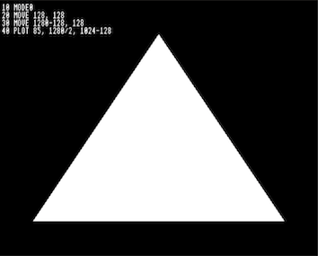
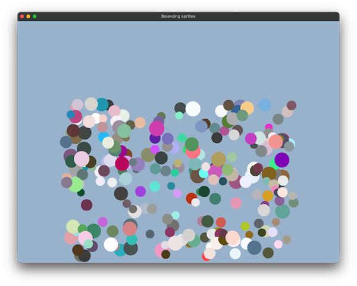
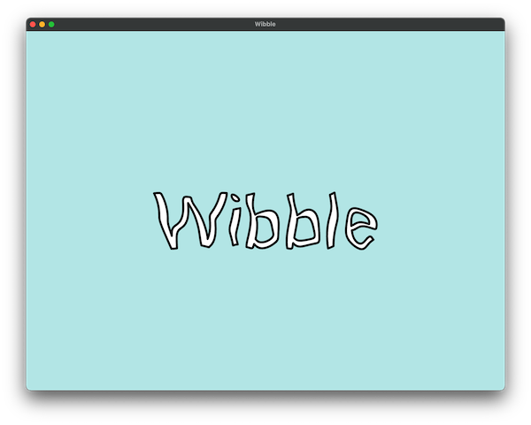
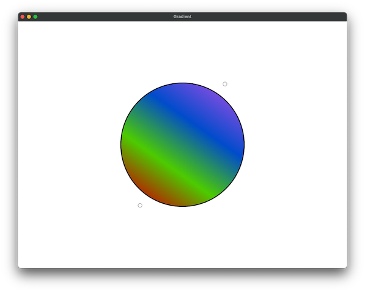
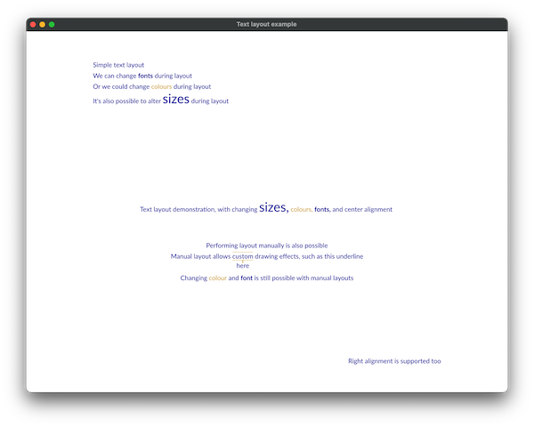
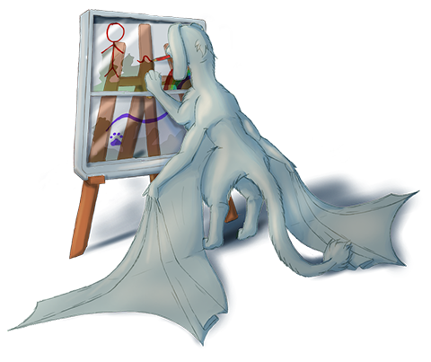

# flo_draw

If you want to render some 2D graphics in Rust to screen *right now* without having to deal with the usual palaver involved with setting up 
a graphics context in a UI framework, [`flo_draw`](https://crates.io/crates/flo_draw) is the crate you need.

`flo_draw` also comes with a powerful set of 2D graphics libraries and has a flexible stream-based API that can make light work of many
tasks that other libraries can make a meal of.

## Motivation

[](https://bbcmic.ro/#%7B%22v%22%3A1%2C%22program%22%3A%22MODE%200%5CnMOVE%20128%2C%20128%5CnMOVE%201280-128%2C%20128%5CnPLOT%2085%2C%201280%2F2%2C%201024-128%5CnA%24%20%3D%20GET%24%22%7D)

While building [FlowBetween](https://github.com/logicalshift/FlowBetween/), I found I needed a few when it came to rendering graphics:
a platform-agnostic API and a way to render bitmap files that's not tied to any one platform. When debugging it, I found another thing
I really wanted was a simple way to just throw up a window and start drawing graphics in it. This used to be quite simple in the 1980s
(as demonstated in the screenshot) but the rise of the GUI and 3D accelleration has made rendering graphics increasingly difficult.

`flo_draw` takes the 2D graphics crates created for FlowBetween and adds an API to take all of the hassle out of the task of making
them work.

## About the libraries

This is a set of libraries that provide a 2D rendering framework for Rust. It provides on and off-screen rendering and
an abstraction API. You might want to read the [guide](draw/GUIDE.md) for some in-depth discussion of what can be achieved
with the libraries in this repository.

* `flo_draw` is a library that renders 2D graphics on-screen via glutin
* `flo_canvas` provides a way to describe 2D drawing operations without being tied to any particular rendering implementation
* `flo_render` is an abstraction API that converts low-level rendering instructions to a graphics API (OpenGL and Metal are supported)
* `flo_render_canvas` converts the instructions described in `flo_canvas` to instructions for `flo_render` (using lyon for the tessellation)
* `flo_render_gl_offscreen` helps `flo_render` by providing system-specific initialisation instructions for offscreen rendering

There are some other implementations of the `flo_canvas` protocol that are not yet packaged up conveniently: in particular,
`canvas.js` allows rendering to an HTML canvas, and FlowBetween contains implementations for Quartz and Cairo.

# Why use these crates?

Apart from the main 'party-piece' trick of popping up a window to render 2D graphics whenever it's needed, `flo_draw` and its companion
crates have a number of other tricks up their sleeves:

* Fully interactive: handle mouse and keyboard events to create graphical demonstrates
* Flexible but straightforward text layout engine (which can render text to vectors if required)
* Draw to bitmaps as well as to the screen
* OpenGL accelerated 2D graphics
* Stream-based API allows for easily composing effects on top of existing rendering instructions
* Layers provide a way to partially update previously rendered graphics
* Sprites provide a way to quickly re-render complex objects
* Rendering from multiple threads (especially easy if each thread has its own layer)
* Stream-based API allows easy redirection of the rendering instructions to the graphics API of your choice (both 2D APIs and GPU APIs)

# Getting started

The `flo_draw` library is the best place to start, it provides a very easy way to render things on-screen:

```Rust
use flo_draw::*;
use flo_canvas::*;

pub fn main() {
    with_2d_graphics(|| {
        let canvas = create_canvas_window("Hello, triangle");

        canvas.draw(|gc| {
            gc.clear_canvas(Color::Rgba(0.0, 0.4, 0.4, 1.0));
            gc.canvas_height(1000.0);
            gc.center_region(0.0, 0.0, 1000.0, 1000.0);

            gc.new_path();
            gc.move_to(200.0, 200.0);
            gc.line_to(800.0, 200.0);
            gc.line_to(500.0, 800.0);
            gc.line_to(200.0, 200.0);

            gc.fill_color(Color::Rgba(0.0, 0.0, 0.8, 1.0));
            gc.fill();
        });
    });
}
```

# Examples

See the [examples](./draw/examples/) folder in the `draw` and `render_canvas` subdirectories for some more things that can be done with the library.



* [`cargo run --example canvas_window`](./draw/examples/canvas_window.rs) - displays a basic window
* [`cargo run --example hello_world`](./draw/examples/hello_world.rs) - traditional
* [`cargo run --example layer_alpha`](./draw/examples/layer_alpha.rs) - blending between layers
* [`cargo run --example bounce_sprites`](./draw/examples/bounce_sprites.rs) - animates some bouncing balls
* [`cargo run --example follow_mouse`](./draw/examples/follow_mouse.rs) - demonstrates event handling by tracking the mouse around
* [`cargo run --example vectoroids`](./draw/examples/vectoroids.rs) - more involved example of event handling with an incomplete game (arrow keys to move, space to fire)
* [`cargo run --example png_triangle`](./render_canvas/examples/png_triangle.rs) - renders a triangle to a png file
* [`cargo run --example mandelbrot`](./draw/examples/mandelbrot.rs) - an interactive mandelbrot set program
* [`cargo run --example wibble`](./draw/examples/wibble.rs) - render text to vectors and distort it in real time
* [`cargo run --example mascot`](./draw/examples/mascot.rs) - render FlowBetween's mascot from some pre-encoded vector instructions
* [`cargo run --example texture`](./draw/examples/texture.rs) - bitmap rendering
* [`cargo run --example texture_sprites`](./draw/examples/texture_sprites.rs) - bouncing balls with bitmap images
* [`cargo run --example texture_spin`](./draw/examples/texture_spin.rs) - bitmap rendering with an animated transformation applied
* [`cargo run --example texture_from_sprite`](./draw/examples/texture_from_sprite.rs) - demonstrates rendering to a texture
* [`cargo run --example texture_from_sprite_dynamic`](./draw/examples/texture_from_sprite_dynamic.rs) - dynamic textures provide a way to render to textures at 'native' canvas resolution
* [`cargo run --example gradient`](./draw/examples/gradient.rs) - gradient rendering
* [`cargo run --example mascot_shadow`](./draw/examples/mascot_shadow.rs) - reprocess the mascot rendering to add some extra shading
* [`cargo run --example wibble_mascot`](./draw/examples/wibble_mascot.rs) - reprocess the mascot rendering to make it wobble
* [`cargo run --example text_layout`](./draw/examples/text_layout.rs) - some effects that can be acheived with the text layout engine
* [`cargo run --example show_tessellation`](./draw/examples/show_tessellation.rs) - demonstrates how 2D graphics are tessellated for display using a GPU (and how to perform this manually and intercept the results)
* [`cargo run --example show_text_tessellation`](./draw/examples/show_text_tessellation.rs) - tessellating text rendered from a font
* [`cargo run --example guide_illustrations`](./render_canvas/examples/guide_illustrations.rs) - regenerate the png files used in the [guide](./draw/GUIDE.md)

 
 

# Companion crates

`flo_draw` was developed alongside several other crates, which may be of interest when developing software that uses the canvas:

* `flo_curves` provides a lot of functionality for manipulating bezier curves.
* `flo_stream` provides pubsub and generator streams, which are useful for distributing events around an application.
    (See the vectoroids example for a way to use a generator stream as a game clock)
* `desync` provides a simpler way to write asynchronous code than traditional threads
* `flo_binding` provides a way to convert between state changes and message streams, used in `flo_draw` to update the window configuration

# Version 0.4

This is version 0.4 of `flo_draw`.

Future versions will incorporate more rendering targets. FlowBetween has Quartz, Cairo and HTML canvas targets so those are very likely, and
some sort of non-accelerated version of the offscreen renderer is also a likely addition. Version 0.4 will likely add some more pipes for
drawing streams: for example, a stream to simplify the rendering instructions so they match up to more conventional 2D graphics libraries
more closely.

There are a few known issues with 0.4: dashed lines don't work too well either in this version.


