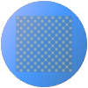

# Drawing 2D graphics in Rust with flo\_draw

This is a guide to using flo\_draw and flo\_canvas to render 2D graphics using Rust. These crates provide a simple yet highly flexible API that can generate all kinds of 2D graphics with a minimum of effort.

Most of this guide will focus on using flo\_draw, which is a library for rendering 2D graphics straight to the screen.

## What is flo\_draw?

`flo_draw` is a crate that makes it easy to bring up a window for rendering 2D graphics. It’s part of a suite of crates that deal with 2D graphics in general, and was designed for the FlowBetween animation editor.

* Quickly write programs that render to a window using OpenGL-accellerated 2D graphics
* Quickly write programs that render to an offscreen buffer
* Incorporate GPU-accellerated 2D graphics into existing projects
* Render 2D graphics to OS-native graphics interfaces
* Render 2D graphics to HTML canvases

## Getting started

Flo\_draw has very little overhead for creating new projects: the goal of the crate is to make drawing graphics as easy as printing text.

A minimal project would just open a blank window. To set this up, start with a terminal command prompt open at a new window, and create a new project.

```bash
cargo init
```

Add flo\_draw as a dependency to the `Cargo.toml` file:

```Toml
[dependencies]
flo_draw = "0.3"
```

Edit main.rs to create a new window:

```rust
use flo_draw::*;
use flo_draw::canvas::*;

fn main() {
    with_2d_graphics(|| {
        let canvas = create_canvas_window("Hello, world");
    });
}
```

Running this will create a new window, and the program will exit once the window is closed. There’s really only two methods to know about: `with_2d_graphics` is used to run the UI thread: it allows the window to persist once the main routine has finished, and is required for some operating systems that can’t run UI routines anywhere other than the main thread.

`create_canvas_window()` is what creates the actual window: this function takes a parameter that can be used to control the properties of the window: passing in a simple string just sets the title but it’s possible to control other attributes like the size and also update the properties after the window is displayed. This version is for when the caller doesn’t want the window to be interactive and just wants to draw some graphics. It returns a `Canvas` object, which is used to store and stream a description of a 2D rendering.

This isn’t terribly interesting yet, so lets draw something in the window:

```rust
        canvas.draw(|gc| {
            gc.new_path();
            gc.move_to(200.0, 200.0);
            gc.line_to(800.0, 200.0);
            gc.line_to(500.0, 800.0);
            gc.line_to(200.0, 200.0);

            gc.fill_color(Color::Rgba(0.0, 0.0, 0.8, 1.0));
            gc.fill();
        });
```

This will render a triangle to our window. Calling `canvas.draw()` calls back a function with a graphics context for the canvas. We can then issue our drawing instructions to this context. Once the call back function returns, the graphics are rendered to the window.

The basic way a context is used is to declare paths by calling `gc.new_path()` followed by some instructions such as `gc.line_to()` to describe the path, before causing the path to be displayed with operations like `gc.fill()`  While a context has many other operations available, the most used by far are those associated with declaring and rendering paths.

Nothing is drawn until the call-back returns: this makes it possible to render flicker-free animations by repeatedly calling the `draw()` method. The window is handled by another thread, so there’s no need to worry about blocking in the callback to `with_2d_graphics`

## Portability

A typical problem with UI frameworks is that they are very ‘sticky’: they’re used throughout an application so once a choice has been made to use one, it’s a lot of work to choose a different one. `flo_draw` is built on an architecture that is designed to make it much easier to use the same rendering code with different UI frameworks.

`flo_draw` is made up of a collection of crates, which work together to make a windowed rendering environment. They can also be used independently, which makes it easy to use code written for `flo_draw` with any other UI framework.

These are the crates:  

- `flo_canvas` describes graphics operations without providing a concrete implementation. The `Canvas` type is defined here.
- `flo_render` describes typical GPU rendering operations and provides implementations for the underlying APIs such as OpenGL and Metal.
- `flo_render_canvas` converts from the instructions in a `Canvas` to the instructions for `flo_render`, and provides a hardware-accelerated offscreen renderer. It uses `lyon` to perform tessellation.
- `flo_draw` uses the `glutin` crate to create an OpenGL context and the other crates to render to it.

What makes rendering code written for `flo_draw` portable is that it’s written to interact only with the `flo_canvas` crate. This crate only lists what graphics operations are possible and deals with sending them elsewhere, so moving the code to a different UI framework is just a matter of changing what that ‘elsewhere’ is.

##  Graphics primitives

The basic graphics primitive is the path. There’s one active path at a time, which is built up by sending a series of instructions. A path can be rendered by calling the `fill()` or `stroke()` instructions. 

A path is started using the `new_path()` call, followed by one or more of the path drawing calls:

- `move_to(x,y)` starts a new subpath
- `line_to(x, y)` adds a line to the current path
- `bezier_curve_to(x, y, cp1x, cp1y, cp2x, cp2y)` adds a bezier curve with the specified control points to the path
- `close()` closes the current subpath with a line from the current point to the point where the subpath was started

There are also some higher-level routines for dealing with paths. These are located in the `GraphicsPrimitives` trait and  are implemented by generating the lower-level calls.

- `rect(x1, y1, x2, y2)` adds a rectangle to the current path, made up of a series of lines
- `circle(x, y, r)` adds a circle to the current path, made up of bezier curves
- `bezier_curve(curve)` converts a structure that implements the `BezierCurve` trait from `flo_curves` to a bezier curve path operation.
- `bezier_path(path)` converts a structure that implements the `BezierPath` trait from `flo_curves` to a subpath in the current path

`fill()` will fill in the area covered by the current path, and `stroke()` will draw an outline around it. These will use the currently set fill or stroke properties. There are a lot of methods to set these properties.

The basic fill properties are:

- `fill_color(col)` - the colour that the filled region should be
- `winding_rule(rule)` - how overlapping subpaths should be rendered
- `blend_mode(mode)` - how the filled region should be blended with the rest of the canvas

The basic stroke properties are:

- `stroke_color(col)` - the colour that the line should be
- `line_width(width)` - the width in canvas units that the line should be
- `line_width_pixels(width)` - the width that the line should be, measured in pixels on the render target
- `line_join(join)` - when two lines join at an angle, how the join should be rendered
- `line_cap(cap)` - how the start and end of a line should be rendered
- `dash_pattern` - defines a ‘dashed’ texture to render the line with
- `blend_mode(mode)` - how the line should be blended with the rest of the canvas

```rust
canvas.draw(|gc| {
    gc.fill_color(Color::Rgba(0.2, 0.2, 0.2, 0.8));
    gc.stroke_color(Color::Rgba(0.2, 0.2, 0.2, 0.8));

    gc.line_width(3.0);

    gc.new_path();
    gc.move_to(-32.0, 28.0);
    gc.line_to(-14.0, 0.0);
    gc.line_to(4.0, 28.0);
    gc.close_path();

    gc.stroke();

    gc.new_path();
    gc.circle(14.0, -16.0, 18.0);
    gc.fill();

    gc.stroke_color(Color::Rgba(0.4, 0.4, 0.4, 0.9));
    gc.new_path();
    gc.rect(-16.0, -16.0, 16.0, 16.0);
    gc.stroke();
});
```

##  Setting the canvas coordinates and transforms

By default, `flo_draw` will set up a canvas that is 1024x768 units (scaled to fill the window). The height is fixed as 768 units but the width will vary with the window size.

The coordinate system can be changed using the transform functions. The simplest of these are just used to define the coordinate system of the main window.`identity_transform()` will reset it to the default coordinates, which are a y value between -1 and 1 and an x value scaled to the window (so that the coordinate `0,0` is at the center of the window). This is also the default coordinate scheme for off-screen contexts. `canvas_height(height)` will set the distance from the top to the bottom of the window, once again with `0,0` at the center - so `canvas_height(768.0)`  will define a coordinate system that goes from -384 at the bottom to 384 at the top. Negative values passed to `canvas_height()` will flip the coordinate scheme.

The central region can be set using `center_region(x1, y1, x2, y2)`.  This call will pan the canvas such that the specified region is centered in the window. This is typically paired with `canvas_height` to specify a bottom-left coordinate: for example `gc.canvas_height(768.0); gc.center_region(0.0, 0.0, 1024.0, 768.0);` to define the default coordinate scheme.

Finally, the `transform()` call can be used with a `Transform2D` structure to apply arbitrary transformations to the coordinate scheme. `Transform2D` represents a 3x3 matrix, and has a number of convenience methods for initialising it. `Transform2D::identity()` will generate the identity matrix. `Transform2D::translate(dx, dy)` will translate by the specified offset. `Transform2D::scale(sx, sy)` will scale the coordinates. `Transform2D::rotate(radians)` and `Transform2D::rotate_degrees(degrees)` will rotate the coordinates. 

Transformations are stored and restored using `push_state()` and `pop_state()` so it’s possible to use `transform()` temporarily to change how some rendering instructions appear.

```rust
canvas.draw(|gc| {
    gc.canvas_height(1000.0);
    gc.center_region(0.0, 0.0, 1000.0, 1000.0);
    gc.transform(Transform2D::rotate_degrees(30));
});
```

##  Layers

The canvas used by `flo_draw` is split into a number of layers. `LayerId(0)` is rendered at the bottom, with the other layers being rendered on top.

You can select a different layer by calling `layer(LayerId(2))`, to select layer 2 for instance. Layer 0 is the default and is the rear-most layer.

`clear_layer()` will remove all graphics on the current layer without affecting any other graphics. Unlike `clear_canvas`, settings like the current transformation is left alone.

This provides a means to add extra rendering underneath the existing graphics, and a way to clear a part of the rendering without affecting the rest. For example, when animating a scene, it’s possible to draw a complex background and then animate the foreground on a separate layer without needing to redraw the background layer.

Another way layers can be used is to build up a rendering in an ordering that’s convenient for a particular algorithm rather than forcing a front-to-back ordering. Eg: it’s possible to add drop shadows later on by drawing to a lower layer.

Layers are particularly helpful when designing multi-threaded code. Different threads can render to different layers so there’s no chance of them interfering with each other (see the Mandelbrot example for a demonstration of this)

```rust
canvas.draw(|gc| {
    gc.layer(LayerId(1));
    
    // Draw a circle
    gc.new_path();
    gc.circle(100.0, 100.0, 100.0);
    gc.fill_color(Color::Rgba(0.0, 0.0, 1.0, 1.0);
    gc.fill();

    // Draw a shadow underneath it
    gc.layer(LayerId(0));
    gc.circle(120.0, 80.0, 100.0);
    gc.fill_color(Color::Rgba(0.0, 0.0, 0.0, 0.5);
    gc.fill();
});
```

##  Sprites

Sprites are a way to repeatedly render a series of instructions. For GPU-based rendering targets, they are also pre-calculated so they can render complex shapes more quickly if necessary. Sprites are conventionally just bitmaps but in `flo_draw` they can be any set of rendering instructions.

There are two steps to rendering a sprite: defining it and rendering it.

To start defining a sprite, call `sprite(SpriteId(2))` to start writing to the definition of sprite 2. `clear_sprite()` will replace any existing rendering instructions that might exist for this sprite, and any following rendering instructions will be stored in the sprite. Use `layer(LayerId(0))` to start writing to layer 0 again once the sprite definition is complete.

A sprite can be rendered to the current layer by calling `draw_sprite(SpriteId(2))`. This will just render the sprite as it was originally drawn, so it’s not very useful by itself. The call `sprite_transform(...)` can be used to set how the next sprite is drawn.  For instance, `sprite_transform(SpriteTransform::Translate(10.0, 20.0)` will render the next sprite to be drawn at an offset of `10.0, 20.0`. 

Sprite transforms stack, so adding another `sprite_transform(SpriteTransform::Translate(10.0, 20.0)` after the first one will render the sprite at an offset of `20.0, 40.0` instead. The `SpriteTransform::Identity` transformation can be used to reset the transformation back to the beginning.

`transform()` will also work to move sprites around, but it will also affect every other rendering instruction: `sprite_transform()` just affects the next sprite to be drawn.

Sprites are very similar to layers: the main difference is that they can be rendered in any order and that they can be rendered multiple times.

Sprites are cleared along with everything else when `clear_canvas()` is called but they will survive `clear_layer()`, so when used for re-rendering or animations, they are best combined with layers.

##  Textures

It’s possible to use a bitmap graphic instead of a solid color to fill shapes. The first step to doing this is to load the bitmap texture into the drawing.

The `create_texture(TextureId(2), width, height, TextureFormat::Reba)` call will set `TextureId(2)` to be an 8-bit RGBA bitmap of the specified width and height (erasing any texture that previously had that ID). There’s a corresponding `free_texture(TextureId(2))` that can be used to release the memory associated with the texture that was created.

To set the pixels in the texture, the `set_texture_bytes(TextureId(2), x, y, width, height, Arc::new(vec![...]))` call is used. The specified region is replaced with the supplied bytes - 4 bytes per pixel indicating the RGBA colors and arranged as columns and rows. This can be used both to load images from files and to directly generate bitmap images.

The `load_texture(TextureId(2), data_stream)` function can be used to load a texture from a stream: this can be a file or a memory stream if needed. The stream can provide data in one of many supported image formats (any supported by the `image` crate).

To draw with a texture, it can be set as the current fill color by calling `fill_texture(TextureId(2), x, y, width, height)`. The coordinates specify where on the canvas the corners of the texture will appear (and the texture will repeat after those coordinates). Any shape drawn after this call will be drawn using the specified texture.

For finer control of the texture, the `set_texture_fill_alpha(TextureId(2), alpha_value)` call can be used to make the texture translucent and `fill_transform(some_transform)` can be used to apply a transformation to the bitmap after the `fill_texture()` call.

Textures are cleared along with everything else when `clear_canvas()` is called, but not when `clear_layer()`is used instead. Loading textures can be quite time consuming, so for animations, it’s best to clear the layers instead of the canvas.

```rust
canvas.draw(|gc| {
    let png_file: &[u8] = include_bytes!("png_file.png");

    let (width, height) = gc.load_texture(TextureId(0), io::Cursor::new(png_file)).unwrap();

    gc.new_path();
    gc.rect(0.0, 0.0, 100.0, 100.0);
    gc.fill_texture(TextureId(0), 0.0, 0.0, 100.0, 100.0);
    gc.fill();
});
```

##  Gradients

Gradients are another alternative to solid colour fills. As with textures, they are defined with an ID then chosen with a `fill_gradient` call.

A gradient can be defined by calling `new_gradient(GradientId(2), initial_color)` and then adding colour stops with `gradient_stop(GradientId(2), position, stop_color)`. The position value is arbitrary other than that the initial position is `0.0`.

A linear gradient can be selected as the fill colour using `fill_gradient(GradientId(2), x1, y1, x2, y2)` - the coordinates indicate the start and end point of the gradient on the canvas.

```rust
canvas.draw(|gc| {
    gc.new_gradient(GradientId(0), Color::Rgba(0.3, 0.3, 0.3, 1.0));
    gc.gradient_stop(GradientId(0), 1.0, Color::Rgba(0.6, 0.6, 0.6, 1.0));

    gc.new_path();
    gc.rect(100.0, 100.0, 200.0, 200.0);
    gc.fill_gradient(GradientId(0), 100.0, 100.0, 200.0, 200.0);
    gc.fill();
});
```

##  Text rendering

`flo_canvas` comes with a set of instructions for basic text rendering and layout, and a formatting library for more advanced layout.

For the basic functions, it’s first necessary to associate a font file with an ID. A font file must be loaded into a `CanvasFontFace` structure. `CanvasFontFace::from_slice(&u8_slice)` will create one from a reference to a slice of binary data, and `CanvasFontFace::from_bytes(u8_vec)` will create one by passing ownership of a `Vec<u8>` to the new font structure. The format should be ttf, otf or woff.

This font can be loaded into the canvas by using `gc.define_font_data(FontId(2), Arc::clone(&font_face))`.  The font size can be set by calling `set_font_size(FontId(2), em_size)`, and a text string can be rendered at a particular position by using `draw_text(FontId(2), String::from("text"), x, y)`. This allows simple text positioning on a canvas, but doesn’t provide a lot of information about how that text will appear. The colour of the text is determined by the currently set fill colour.

An `em_size` specifies the canvas units that map to one em in font units. Text in two fonts rendered with the same `em_size` will appear roughly the same height, and it’s usually approximately the size of the ascender (the height that characters extend above the baseline) for the font.

It’s also possible to lay out text with formatting changes. To do this, call `begin_line_layout(x, y, TextAlignment::Left)`. This will start laying out a line with a baseline starting at the specified x and y coordinates. `layout_text(FontId(2), String::from("text")` will add some more text to the current line using a particular font: the font can be changed as the line goes on, and the font size can even be altered with `set_font_size()` as the line goes on. Once all the text is loaded into the line, calling `draw_text_layout()` will render it. While this provides some more control over how a line of text is rendered, there’s still no feedback over how much space it’s taking up.

The simplest way to get this feedback and measure some text is to call the `::measure_text(&font_face, "text", em_size)` function. This will return the size of a string laid out using a font of a particular em\_size. Unlike the other functions, this is a bare function and is called without needing a graphics context. This will return the bounding box for the text in the specified font, along with the position of the baseline for any following text.

```rust
let lato        = CanvasFontFace::from_slice(include_bytes!("Lato-Regular.ttf"));

let hello_size  = measure_text(&lato, "Hello, World", 100.0);
let (min, max)  = hello_size.inner_bounds;

let x_pos       = (1000.0 - (max.x()-min.x()))/2.0;
let y_pos       = (1000.0 - (max.y()-min.y()))/2.0;

canvas.draw(|gc| {
    gc.canvas_height(1000.0);
    gc.center_region(0.0, 0.0, 1000.0, 1000.0);

    gc.define_font_data(FontId(1), Arc::clone(&lato));
    gc.set_font_size(FontId(1), 100.0);

    gc.fill_color(Color::Rgba(0.0, 0.0, 0.6, 1.0));
    gc.draw_text(FontId(1), "Hello, World".to_string(), x_pos as _, y_pos as _);
});
```

##  Performing text layout

One problem with using `measure_text()` is that it must perform almost all of the steps to lay out the text in order to calculate its metrics, but these same steps are needed to render the text, so this is inefficient. To avoid this problem, there is a `draw_glyphs(FontId(2), glyph_positions)` call that allows rendering  text that has been laid out ahead of time. Laying out text in advance makes it easier to find the positions of line breaks and add effects like strikeout and underlines.

This can be used with any layout engine, but there’s one provided in the `flo_canvas` crate that’s designed to provide a straightforward API, and avoid the need to generate font glyphs manually. A new text layout can be created by calling `CanvasFontLineLayout::new(font_face, em_size)`. This structure stores the layout and any extra drawing instructions for a single line of text.

Note that the `FontId` values for the canvas are set when finalizing the layout, so only the font face needs to be known when starting a new layout.

Text can be added to the layout by calling `line_layout.add_text("some string")`. This will lay out the text and advance the text position to the place where the next text should be added.

The way a new font or font size is selected is by calling `let mut line_layout = line_layout.continue_with_new_font(last_font_id, new_font_face, new_em_size)`. You must provide the font ID for the preceding layout at this point as it will be finalized, along with the font face structure and size for the following layout.

Once a line of text is ready to render, the `line_layout.align_transform(baseline_x, baseline_y, TextAlignment::Left)` call will arrange it so that it’s aligned at a particular position. The completed text can be sent to the graphics context using the `draw_list()` function with the result of the `to_drawing` function: `gc.draw_list(line_layout.to_drawing(last_font_id))` - note that once again the font ID for the canvas is not set until the layout is being finalized.

During layout, the bounding box of the text can be obtained using `line_layout.measure()`. Layout starts from `(0.0, 0.0)` so this will provide the width and the height of the bounding box rather than the final coordinates after the text has been aligned. This can be used during layout to calculate where to put annotations or to decide whether or not to insert a line break.

The `measure()` call only returns information about the text layout. Fonts have some additional metrics, such as their height or where underlines should be drawn. These can be retrieved from the `CanvasFontFace` structure using the `font_metrics(em_size)` call. The metrics returned by this call are scaled according to the size that’s passed in so they can be used directly when laying out text of that size. The returned structure includes values such as the `ascender` and `descender` (how far the font extends above or below the baseline).

An in-progress line layout can be cloned: this is useful if speculative layout is required: for example to add a word to the layout and then measure it to see if it is too long to fit on the line.

Drawing annotations of any kind can be added to a line layout using the `line_layout.draw(drawing)` call: this takes something like a `Vec<Draw>` list of instructions, and can be used to add effects like underlines by drawing on the existing text. These drawing instructions are aligned by the `align_transform()` call and relayed to the final result during the `to_drawing()` call so the same coordinate scheme as the one returned by the `measure()` call can be used.

To make this even easier, both `Vec<Draw>` and the `CanvasFontLineLayout` structure itself implement `GraphicsContext`, so you can call the same graphics context functions used on a canvas directly on the line layout. For instance, `line_layout.new_path()` will add a new path instruction to an existing text layout.

```rust
let lato        = CanvasFontFace::from_slice(include_bytes!("Lato-Regular.ttf"));
let lato_bold   = CanvasFontFace::from_slice(include_bytes!("Lato-Bold.ttf"));

canvas.draw(|gc| {
    gc.define_font_data(FontId(1), Arc::clone(&lato));
    gc.define_font_data(FontId(2), Arc::clone(&lato_bold));

    let mut text_layout = CanvasFontLineLayout::new(&lato, 18.0);
    text_layout.add_text("Manual line layout ");

    let mut text_layout = text_layout.continue_with_new_font(FontId(1), &lato_bold, 18.0);
    text_layout.add_text("with bold text");

    text_layout.align_transform(500.0, 400.0, TextAlignment::Center);
    gc.draw_list(text_layout.to_drawing(FontId(2)));
});
```

## Animating the canvas

## Offscreen rendering

## Handling events

## Using window properties

## Streaming Draw instructions

## Streaming raw render instructions

## Encoding and streaming canvas operations elsewhere

## Using flo\_canvas to interface with other rendering libraries

## 

