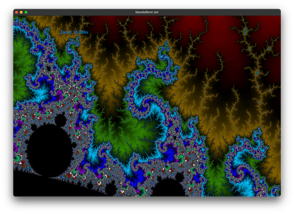

```toml
flo_draw = "0.4"
```

# flo_draw
If you want to render some 2D graphics in Rust to screen *right now* without having to deal with the usual palaver involved with setting up 
a graphics context in a UI framework, [`flo_draw`](https://crates.io/crates/flo_draw) is the crate you need.

`flo_draw` also comes with a powerful set of 2D graphics libraries and has a flexible stream-based API that can make light work of many
tasks that other libraries can make a meal of.

## Motivation

[](https://bbcmic.ro/#%7B%22v%22%3A1%2C%22program%22%3A%22MODE%200%5CnMOVE%20128%2C%20128%5CnMOVE%201280-128%2C%20128%5CnPLOT%2085%2C%201280%2F2%2C%201024-128%5CnA%24%20%3D%20GET%24%22%7D)

While building [FlowBetween](https://github.com/logicalshift/FlowBetween/), I found I needed a few when it came to rendering graphics:
a platform-agnostic API and a way to render bitmap files that's not tied to any one platform. When debugging it, I found another thing
I really wanted was a simple way to just throw up a window and start drawing graphics in it. This used to be quite simple in the 1980s
(as demonstated in the screenshot) but the rise of the GUI and 3D accelleration has made rendering graphics increasingly difficult.

`flo_draw` takes the 2D graphics crates created for FlowBetween and adds an API to take all of the hassle out of the task of making
them work.

## Basic example

Here's a simple example that will open up a window with a triangle in it:

```Rust
use flo_draw::*;
use flo_canvas::*;

pub fn main() {
    with_2d_graphics(|| {
        let canvas = create_canvas_window();

        canvas.draw(|gc| {
            gc.clear_canvas(Color::Rgba(0.0, 0.0, 0.0, 1.0));
            gc.canvas_height(1000.0);
            gc.center_region(0.0, 0.0, 1000.0, 1000.0);

            // Draw a rectangle...
            gc.new_path();
            gc.move_to(0.0, 0.0);
            gc.line_to(1000.0, 0.0);
            gc.line_to(1000.0, 1000.0);
            gc.line_to(0.0, 1000.0);
            gc.line_to(0.0, 0.0);

            gc.fill_color(Color::Rgba(1.0, 1.0, 0.8, 1.0));
            gc.fill();

            // Draw a triangle on top
            gc.new_path();
            gc.move_to(200.0, 200.0);
            gc.line_to(800.0, 200.0);
            gc.line_to(500.0, 800.0);
            gc.line_to(200.0, 200.0);

            gc.fill_color(Color::Rgba(0.0, 0.0, 0.8, 1.0));
            gc.fill();
        });
    });
}
```

For more information, you may be interested in the [guide](GUIDE.md), or the [examples](examples).

* [`cargo run --example canvas_window`](./examples/canvas_window.rs) - displays a basic window
* [`cargo run --example hello_world`](./examples/hello_world.rs) - traditional
* [`cargo run --example layer_alpha`](./examples/layer_alpha.rs) - blending between layers
* [`cargo run --example bounce_sprites`](./examples/bounce_sprites.rs) - animates some bouncing balls
* [`cargo run --example follow_mouse`](./examples/follow_mouse.rs) - demonstrates event handling by tracking the mouse around
* [`cargo run --example vectoroids`](./examples/vectoroids.rs) - more involved example of event handling with an incomplete game (arrow keys to move, space to fire)
* [`cargo run --example png_triangle`](./render_canvas/examples/png_triangle.rs) - renders a triangle to a png file
* [`cargo run --example mandelbrot`](./examples/mandelbrot.rs) - an interactive mandelbrot set program
* [`cargo run --example wibble`](./examples/wibble.rs) - render text to vectors and distort it in real time
* [`cargo run --example mascot`](./examples/mascot.rs) - render FlowBetween's mascot from some pre-encoded vector instructions
* [`cargo run --example texture`](./examples/texture.rs) - bitmap rendering
* [`cargo run --example texture_sprites`](./examples/texture_sprites.rs) - bouncing balls with bitmap images
* [`cargo run --example texture_spin`](./examples/texture_spin.rs) - bitmap rendering with an animated transformation applied
* [`cargo run --example gradient`](./examples/gradient.rs) - gradient rendering
* [`cargo run --example mascot_shadow`](./examples/mascot_shadow.rs) - reprocess the mascot rendering to add some extra shading
* [`cargo run --example wibble_mascot`](./examples/wibble_mascot.rs) - reprocess the mascot rendering to make it wobble
* [`cargo run --example text_layout`](./examples/text_layout.rs) - some effects that can be acheived with the text layout engine
* [`cargo run --example show_tessellation`](./examples/show_tessellation.rs) - demonstrates how 2D graphics are tessellated for display using a GPU (and how to perform this manually and intercept the results)
* [`cargo run --example show_text_tessellation`](./examples/show_text_tessellation.rs) - tessellating text rendered from a font

## --

 

